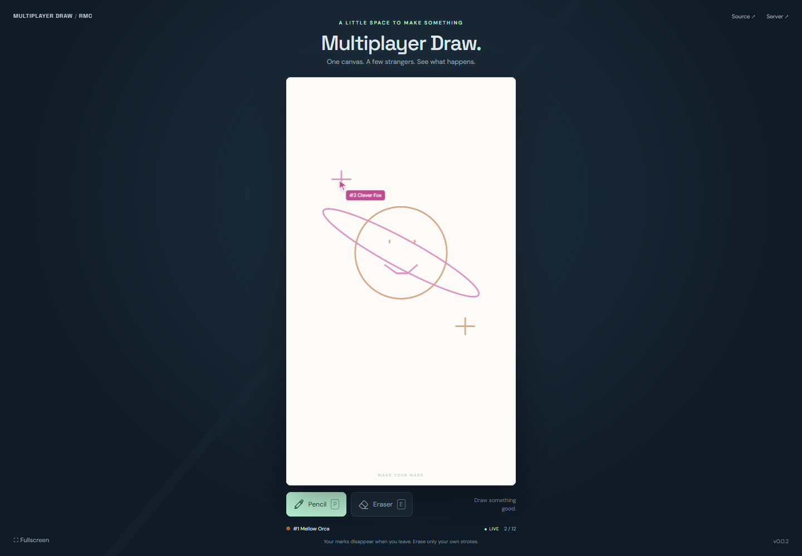

# Multiplayer Draw

A shared portrait drawing canvas built with Babylon Lite and Colyseus. Pick a pencil, make a mark, and see other players drawing alongside you. Erase only your own whole strokes; your artwork disappears when you leave.

**Status: implemented and tested locally, with a live backend. GitHub Pages and the first shared-client release are pending the Vercel automation token.**



[Shared backend](https://github.com/SamuelAsherRivello/rmc-colyseus-multiplayer-server) · [Verification evidence](multiplayer-draw/documentation/verification.md)

## Controls

- Pencil button or **P**: draw with a mouse, pen or touch.
- Eraser button or **E**: erase your own whole strokes.
- Fullscreen control: expand the page.
- Full room: retry when a seat opens. Unexpected disconnects retry automatically with a fresh identity.

Up to 12 participants share the canvas. No accounts or lobby are needed. Player numbers reuse empty seats; names and colors are assigned by the server. Reconnecting or refreshing removes previous artwork after the server detects the departure.

## Development

Use Node 24, npm, and a recent WebGPU-capable browser.

This pre-release workspace currently installs the locally built shared-client tarball from `.setup/`. That ignored artifact is available in the current workspace but not a fresh checkout. Publishing the backend client release and replacing this dependency with its pinned public URL is an explicit remaining release gate.

With that package available:

```sh
npm ci
npm test
npm run build
npm run dev
```

Open the URL printed by Vite. The default backend is the live Vercel deployment. Override `VITE_SERVER_URL` to use a local server. Run `npm run test:browser` against a running local frontend for desktop/touch/browser verification; it uses installed Playwright Chromium. No secrets belong in frontend configuration.

## Layout and delivery

The repository root is the npm project. Application code and documentation live under `multiplayer-draw/`. Babylon Lite renders the drawing surface through WebGPU; HTML provides the accessible controls and connection panel. The shared client manages admission, identity and reconnecting.

The `version.txt` file is the frontend version source. The checked-in **Release** workflow increments its patch version, publishes the GitHub Release and explicitly invokes **Deploy live demo**, including when the release commit was created by a workflow token. Release remains pending; a verified Play link will be added after Pages deployment.

## Limitations

Vercel can end sessions around five minutes. The client rejoins automatically as a new player; previous artwork is removed. This is an experimental portfolio service with in-memory state, not a guarantee of singleton routing or durable storage. Drawing limits are 100 strokes / 10,000 points per player; erase strokes to reclaim space. Physical-device touch testing is not claimed.

## Provenance

Created using [github-repository-template](https://github.com/SamuelAsherRivello/github-repository-template) and [ai-skills-library](https://github.com/SamuelAsherRivello/ai-skills-library). Exact revisions are recorded in [SOURCE_REVISIONS.md](SOURCE_REVISIONS.md). The single-player global skill was preserved; multiplayer is this project's explicit override.

Confirmed brief: “the game is babylon-lite-multiplayer-draw, ‘Multiplayer Draw’ with folder name ‘multiplayer-draw’.” The accepted OpenSpec change records the detailed multiplayer requirements. Original interface, procedural paper texture, icon and pointer-drawn screenshot artwork were created for this project. Fonts: DM Sans and Space Grotesk from Google Fonts.
